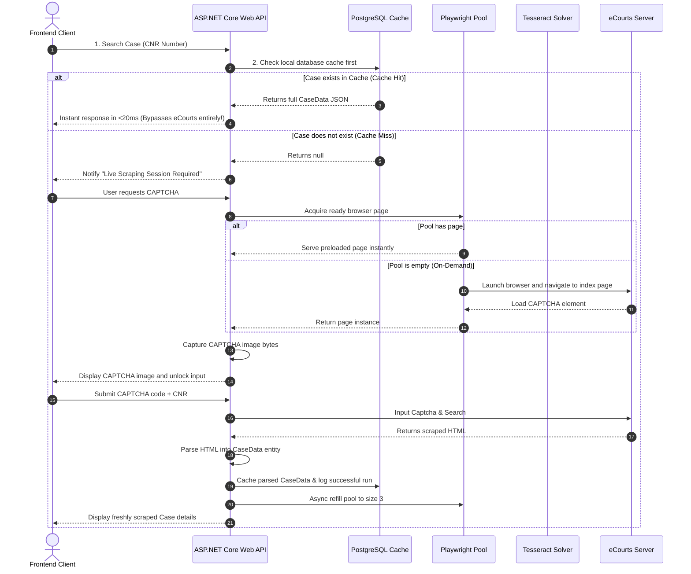

# eCourts Web Scraping Portal: Caching & CCHP Architecture Guide

This guide provides an in-depth, developer-focused walkthrough of the architectural and database design decisions implemented to connect the eCourts Web Scraper backend to PostgreSQL, optimize CAPTCHA fetching, and run dynamic analytics on the React Frontend dashboard.

---

## 🏛️ 1. High-Level Architectural Flow

Below is the state-driven workflow showing how user queries are routed. The architecture prioritizes **database-first local lookups** to completely isolate the eCourts server from unnecessary network calls and prevent IP rate-limiting or blocking.



---

## 🗄️ 2. PostgreSQL Caching & Persistence Layer

We wanted to persist highly structured eCourt case records (which contain multiple nested arrays like Hearings, Orders, Acts, and Litigants) without over-complicating the schema or managing 10 separate relational tables.

### A. EF Core `jsonb` Value Converters
Instead of creating heavy foreign-key relationships, we mapped all nested lists directly to PostgreSQL **`jsonb`** columns. This allows us to store arbitrary, complex JSON arrays in a single column while preserving full queryability.

In [CaseDbContext.cs](file:///k:/Projects/eCourt_Webscrape/backend/Data/CaseDbContext.cs), we defined `System.Text.Json` converters:

```csharp
var jsonOptions = new JsonSerializerOptions { PropertyNamingPolicy = JsonNamingPolicy.CamelCase };

builder.Entity<CaseData>()
    .Property(e => e.Petitioners)
    .HasConversion(
        v => JsonSerializer.Serialize(v, jsonOptions),
        v => JsonSerializer.Deserialize<List<PetitionerRespondent>>(v, jsonOptions) ?? new List<PetitionerRespondent>(),
        ValueComparer.CreateDefault(typeof(List<PetitionerRespondent>), true)
    )
    .HasColumnType("jsonb");
```
* **Benefits**:
  1. No migrations or table relationships to manage as scraping requirements evolve.
  2. Sub-millisecond record serialization and deserialization.
  3. Fully compatible with native PostgreSQL indexing for rapid complex search lookups.

### B. Auto-Created Schema & Startup Hook
Inside [Program.cs](file:///k:/Projects/eCourt_Webscrape/backend/Program.cs), we registered the db context using the PostgreSQL driver:
```csharp
builder.Services.AddDbContext<CaseDbContext>(options =>
    options.UseNpgsql(builder.Configuration.GetConnectionString("DefaultConnection")));
```
To guarantee a frictionless, zero-setup onboarding experience, we placed an auto-initialize check on application startup:
```csharp
using (var scope = app.Services.CreateScope())
{
    var dbContext = scope.ServiceProvider.GetRequiredService<CaseDbContext>();
    // Automatically creates the database and all tables if they don't exist
    dbContext.Database.EnsureCreated();
}
```
*When you start the backend, it automatically hooks up your local PostgreSQL instance, checks if `ecourt_tracker` database exists, and instantly sets up the `cases` and `search_logs` tables!*

---

## 🔒 3. Rate-Limit Shielding & Lazy CAPTCHAs

Repeated hits to eCourts for CAPTCHAs will immediately lead to your host IP address being blacklisted. We designed a dual-defense mechanism to shield your scraper:

### A. Lazy CAPTCHA loading (Frontend)
Normally, scrapers fetch a fresh CAPTCHA immediately when the search page mounts. We removed this background traffic entirely in [CnrNumber.jsx](file:///k:/Projects/eCourt_Webscrape/Frontend/src/pages/CnrNumber.jsx). 
Now:
1. **The CAPTCHA Box starts in a "Lazy Loaded" state**. No requests are sent to eCourts when simply opening or navigating the portal.
2. Clicking **Manual Search** initially queries the lightweight local endpoint `/api/ECourt/case/{cnr}`.
3. If the case is found in your PostgreSQL database, it's displayed instantly with **zero** browser launches and **zero** network requests to eCourts.
4. Only upon a cache-miss is the user presented with a premium, glowing **`⚡ Get CAPTCHA Challenge`** button. Clicking this triggers the live session and displays the CAPTCHA image challenge, safely initializing the Playwright pipeline on-demand!

### B. Idle Pool Refills (Zero Background Footprint)
Previously, the server maintained a preloaded pool of 3 open browser pages, constantly discarding and refilling them in a background cleanup loop every few minutes. This created continuous, automated crawling traffic even when no searches were active.

We modified [PlaywrightSessionManager.cs](file:///k:/Projects/eCourt_Webscrape/backend/Services/PlaywrightSessionManager.cs):
* **On Startup**: Background preloading is commented out. The application starts quietly.
* **On Idle**: The periodic cleanup task checks for stale preloaded browser pages and closes them to save memory and prevent session timeouts. Crucially, **it does not refill the pool automatically while idle**.
* **On-Demand Refills**: Refilling only occurs *after* a live search is initiated. This creates a highly responsive, self-healing pool of up to 3 pages that automatically drains down to 0 background pages when the app goes idle.

---

## 📈 4. Real-time Dashboard Analytics

To turn raw logs into actionable intelligence, we added a series of analytical endpoints in [EcourtController.cs](file:///k:/Projects/eCourt_Webscrape/backend/Controllers/EcourtController.cs) and linked them with a high-fidelity frontend layout:

```
[stats]  --> Fetches Total Searches, OCR Bypass Counts, and Live Sessions.
[recent] --> Fetches Top 10 Search Logs detailing success status and scraper messages.
```

### A. Interactive UI Integrations
In [Dashboard.jsx](file:///k:/Projects/eCourt_Webscrape/Frontend/src/pages/Dashboard.jsx), these numbers are re-polled every 10 seconds. The "Recent Activities" section is fully interactive:
* **Deep Links**: Clicking on *any* historical search log row on the dashboard captures the CNR number, pre-fills it inside the CNR Search field, and automatically triggers an automated database-first query or live scraper check.

### B. CSS Visual Tokens & Transitions
The dashboard's visual style is coded inside [Dashboard.css](file:///k:/Projects/eCourt_Webscrape/Frontend/src/pages/Dashboard.css) using glassmorphic cards and dynamic gradient progress bars for system health check-ups:
```css
.stat-card {
  background: var(--card-bg);
  border: 1px solid var(--border);
  border-radius: 16px;
  box-shadow: var(--shadow);
  transition: all 0.25s cubic-bezier(0.4, 0, 0.2, 1);
}
.stat-card:hover {
  transform: translateY(-4px);
  border-color: var(--accent-border);
  box-shadow: 0 12px 20px -8px var(--accent-bg);
}
.progress-fill {
  background: linear-gradient(90deg, var(--accent), #e879f9);
}
```
* **Theme Adaptability**: By referencing `var(--card-bg)`, `var(--border)`, and `var(--accent)`, the dashboard adapts dynamically and looks stunning in both light and sleek dark modes!

---

## 🛠️ 5. Maintenance & Diagnostics Reference

### File Map
1. **Database Mappings**: [CaseDbContext.cs](file:///k:/Projects/eCourt_Webscrape/backend/Data/CaseDbContext.cs) (PostgreSQL jsonb serialization)
2. **Models**: [Models.cs](file:///k:/Projects/eCourt_Webscrape/backend/Models/Models.cs) (CaseData and SearchLog entities)
3. **Endpoints & Routing**: [EcourtController.cs](file:///k:/Projects/eCourt_Webscrape/backend/Controllers/EcourtController.cs) (Controls analytical queries and cache layers)
4. **Session Pool**: [PlaywrightSessionManager.cs](file:///k:/Projects/eCourt_Webscrape/backend/Services/PlaywrightSessionManager.cs) (On-demand resource management)
5. **Views & Pages**: [CnrNumber.jsx](file:///k:/Projects/eCourt_Webscrape/Frontend/src/pages/CnrNumber.jsx) and [Dashboard.jsx](file:///k:/Projects/eCourt_Webscrape/Frontend/src/pages/Dashboard.jsx) (Frontend presentation templates)
6. **Stylesheets**: [Dashboard.css](file:///k:/Projects/eCourt_Webscrape/Frontend/src/pages/Dashboard.css) (Interactive layout design system)
